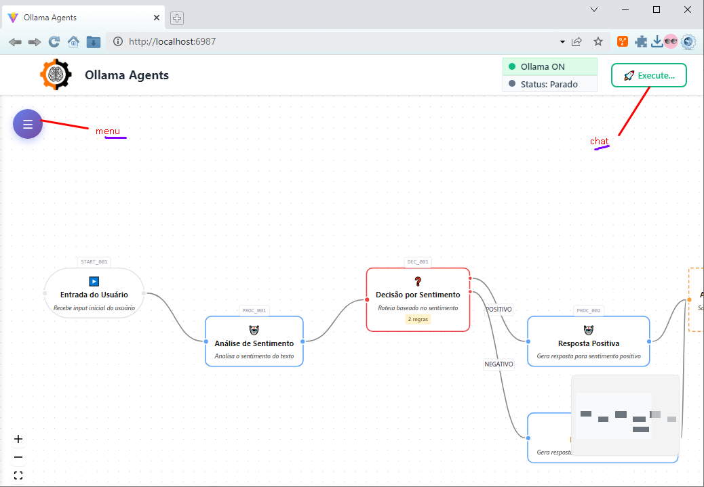

<video src="(docs/video.mp4">Veja</video>

# Agent Workflow Editor

Editor visual de workflows para construção de diálogos de agentes. Rápido, leve e porável usando Electron



## 🚀 Características

- **Leve ! O mais leve do mercado.**
- **Interface Visual Intuitiva**
- **Tipos de Nós Diversos**: Agentic, Decision, Memory, Start, End,
- **Execução em Tempo Real**: Execute workflows e veja o progresso em tempo real
- **Integração com Ollama**: Conecte com modelos de IA locais
- **Aplicação Desktop**: Funciona 100% offline como aplicação nativa
- **Multiplataforma**: Windows, macOS e Linux com Eletron

## 📦 Instalação

### Opção 1: Executável Pronto (Windows)

1.  Baixe um arquivo de pre-release !
    
### Opção 2: Diversão rápida

```bash
# Clone o repositório
git clone https://github.com/oliveiracwb/workflow-agent.git
cd workflow-agent
npm install
npm run dev
```

## 🛠️ Gerar executáveis sérios

```bash
npx electron-builder
```

## 🎯 Como Usar

### 1\. Criando um Workflow

1.  **Abra a aplicação**
2.  **Acesse o menu hamburger**
3.  **Crie nós, configure prompts ! Não se esqueça do inívio e fim.**
4.  **Salve seu trabalho em JSON onde quiser.**

### 2\. Tipos de Nós

- **🚀 Start**: Ponto de início do workflow
- **🤖 Agentic**: Nós com IA que processam prompts
- **❓ Decision**: Nós de decisão com múltiplas saídas
- **💾 Memory**: Nós de armazenamento de contexto
- **🏁 End**: Ponto final do workflow

### 3\. Executando Workflows

1.  **Configure Ollama**: Certifique-se que o Ollama está rodando
2.  **Abra o Chat**: Clique em “💬 Execute” 
3.  **Configure o WF**: Forneça input inicial para o workflow
4.  **Acompanhe**: Veja e veja execução em tempo real

### 4\. Dica

1.  **Use modelos instructs: são mais propensos a responder adequadamente as saidas JSON**
2.  **Requer Node.js >= 20.1**
3.  **Variáveis**: Simples como a saída de um fluxo seguido pelo nome do atributo do campo JSON de saida (PROC_9989874.[field_json_saida])

## 🔧 Configurações

### Variáveis de Ambiente

```bash
# Endereço do Ollama (padrão: http://localhost:11434)
VITE_WF_OLLAMA_ADDRESS=http://localhost:11434
```

### Configuração no JSON

```json
{
  "config": {
    "defaultModel": "llama2",
    "ollamaAddress": "http://localhost:11434",
    "availableModels": ["llama2", "codellama", "mistral"]
  }
}
```

## 🐛 Solução de Problemas

### Erro de Conexão com Ollama

1.  Verifique se o Ollama está rodando: `ollama list`
2.  Teste a conexão: `curl http://localhost:11434/api/tags`
3.  Configure o endereço correto nas configurações

### Aplicação não Abre

1.  Verifique se tem permissões de execução
2.  Execute como administrador se necessário
3.  Verifique logs no console (F12 em desenvolvimento)

## 🏗️ Arquitetura Técnica

- **Frontend**: React + TypeScript + React Flow
- **Desktop**: Electron
- **IA**: Integração com Ollama
- **Styling**: CSS-in-JS

## 📄 Licença

Este projeto está sob licença MIT. Veja o arquivo LICENSE para mais detalhes.

## 🤝 Contribuição

1.  Fork o projeto
2.  Crie uma branch para sua feature
3.  Commit suas mudanças
4.  Push para a branch
5.  Abra um Pull Request

## 📞 Suporte

- **Issues**: Use o GitHub Issues para reportar bugs
- **Documentação**: Consulte a documentação do React Flow
- **Comunidade**: Participe das discussões no GitHub

* * *

[Assista à demonstração](docs/video.mp4)

**Desenvolvido por Oliveira com ❤️ usando React Flow e Electron**
